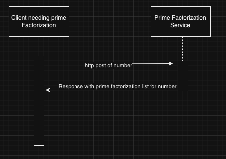

# CS361_PrimeFactorizationService

## Service set up steps

- pip install the requirements.txt if you don't already have them ``` pip install -r requirements.txt ```
- start the service ```python server.py```

## Example usage

### Notes/Preconditions
- the service expects a post http request with a json payload that has 'number' as a key
- the service runs on your local host on port 5000. Address 'http://127.0.0.1:50000/receive_message'

Example usage using python:
```
import requests

# URL for the local Flask server - this is the address of the service
url = 'http://127.0.0.1:50000/receive_message'

# JSON payload with the number to receive prime factorization for
payload = {"number": "19"}

# Send an http POST request and receive the response - i.e. an example call
response = requests.post(url, json=payload)

# Do something with the response
print("Server response:", response.json(), "Status Code:", response.status_code)
```

## UML

